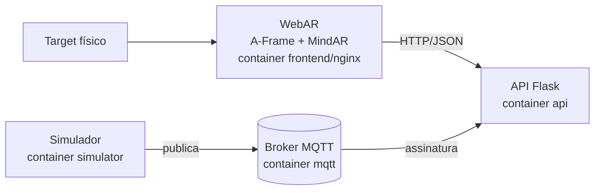

# Arquitetura

```mermaid
flowchart LR
  T[Target físico] --> W[WebAR<br/>A-Frame + MindAR<br/>container frontend/nginx]
  W -- HTTP/JSON --> A[API Flask<br/>container api]
  S[Simulador<br/>container simulator] -- publica --> M[(Broker MQTT<br/>container mqtt)]
  M -- assinatura --> A
```
O navegador nunca fala MQTT: só HTTP/JSON com a API (via proxy do nginx).
